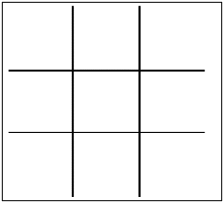
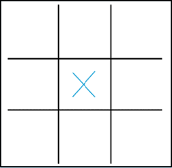
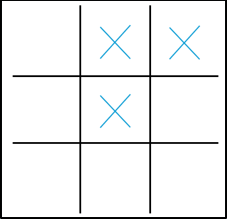
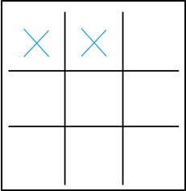
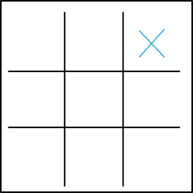

#  Guide: Tic-Tac-Toe 

=== "Introduction"

    ## Introduction 
    
    Tic Tac Toe is a two-player, turn-based game played on a 3x3 grid. Each player is either an “X” or an “O”. The objective of the game is for a player to get three of their symbols (e.g., “X” or “O”) in a row horizontally, vertically, or diagonally. The first player to achieve this objective wins the game; however, if all cells are filled and neither player has achieved three in a row, then the game ends in a draw. Read through the following prerequisites and instructions for further detail.

    ### Prerequisites

    - sheet of paper
    - writing utensils

=== "Instructions"

    ## Instructions

    1. Draw a 3x3 grid on a piece of paper as shown in the figure below.

        

    2. Decide which player will be “X” and which player will be “O”.
    3. Flip a coin to determine which player has the first turn.
    4. Take turns marking one empty cell at a time with the player’s respective symbol.

        !!! note 

            Plan moves that either result in getting three in a row or that block an oppenent from doing so; see Appendix A for more details.

    5. Play until a player wins or there is a draw.

        !!! note

            A player wins by achieving three of their symbols in a row horizontally, vertically, or diagonally. The game ends in a draw if neither player achieves three in a row and there are no open spaces left on the grid.

    6. Return to step 1 to play again.

=== "Appendix A"

    ## Appendix A

    | Strategy                | Details                                                                                                                                                                                       | Example |
    |-------------------------|-----------------------------------------------------------------------------------------------------------------------------------------------------------------------------------------------|---------|
    | Take the center         | During the first turn, a player should place their symbol in the center square. This gives them the most opportunities to achieve three in a row.                                             |          |
    | Block an opponent’s win | A player can block an opponent from achieving three in a row by prioritizing blocking their moves over creating winning combinations.                                                         |          |
    | Create forks            | Forks occur when a player has two potential winning combinations on the board. The opponent can only block one combination, thus giving the player the opportunity to win on their next turn. |         |
    | Watch for two-in-a-row  | A player should look for opportunities to create two-in-a-row patterns to pressure their opponent into blocking their next move. This can allow the player to set up future winning moves.    |         |
    | Control the corners     | Occupying a corner square gives the most flexibility and control over the board; forks can be created more easily.                                                                            |         |
    | Stay flexible           | A player should adapt their strategy based on the game’s progression and their opponent’s moves to maintain control of the board.                                                             | N/A     |

| Sign-off Date | Name |
|------|------|
| 07/10/2024 | Mickey Mouse |