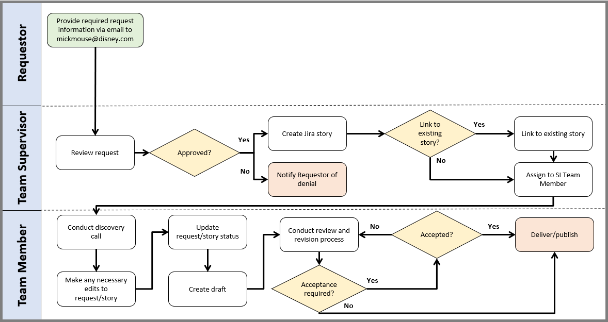
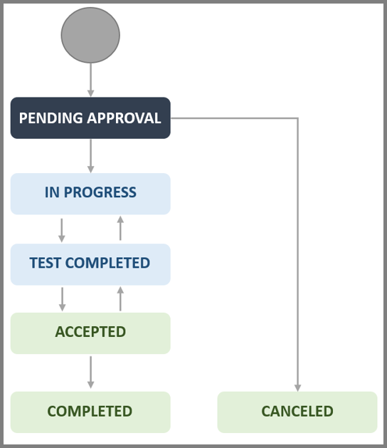

# Documentation Request Procedure

=== "Introduction"

    ## Introduction

    ### Purpose
    The purpose of this procedure is to provide details regarding the tasks associated with receiving and fulfilling documentation requests. It identifies who is responsible for approving, writing, revising, and publishing requested documentation.

    ### Audience
    This procedure applies to all personnel submitting a documentation request ("**Requester**") to the Documentation Team (“**Team**”) and to Team personnel fulfilling those request(s).

    ### Roles and Responsibilities
    | Role | Responsibility |
    |------|----------------|
    | Requestor | Provide required request information. |
    | Team Member | Write, review, revise, and publish requested documentation. | 
    | Team Supervisor | Review documentation requests and create Jira stories. |

    ### Definitions
    | Type | Term | Definition |
    |------|------|------------|
    | Jira Linking | "Is a child of” | Linking category for a request that sits below another issue or request (e.g., a subtask that belongs to a task). |
    | Jira Linking | "Is a parent of” | Linking category for a request that sits above another issue or request (e.g., a story that is made up of subtasks). |
    | Jira Linking | "Is related to” | Linking category for a request that is related to an existing issue or request. |
    | Jira Status | Accepted | Status of requests that have been accepted for delivery/publication. |
    | Jira Status | Pending Approval | Status of requests that: 1) have undergone steps 2-7 of the procedure or 2) have undergone steps 2-7 of the procedure ("approved"), but work has not begun |
    | Jira Status | Canceled | Status of requests that have been rejected or canceled. |
    | Jira Status | Completed | Status of requests that have been delivered/published. |
    | Jira Status | In Progress | Status of approved requests that a **Team Member** is actively working on. |
    | Jira Status | Test Completed | Status of requests that are being reviewed and discussed by a **Team Member** and the **Requester(s)**, Stake Holder(s), and/or Subject Matter Expert(s) (SME) in meetings, chat, email, etc. for additional information and/or confirmation of content and/or formatting. |
    | Request Terminology | Intended audience | The individual(s) or group(s) the documentation is intended for. |
    | Request Terminology | Medium | The means by which the documentation will be delivered/published (e.g., SharePoint site, PDF, Word document, etc.). |
    | Request Terminology | Milestones/Deadlines | Hallmarks of progress for the documentation and/or the date it needs to be completed by. |
    | Request Terminology | Purpose | The specific topic, intended use, and/or goals of the documentation. |
    | Request Terminology | Scope | An in-depth description of sub-tasks, outline/tree, desired layout/format, etc.; includes any additional details that can provide further context for the documentation (e.g., a SharePoint site that reflects the desired formatting, applicable regulations or standards, etc.). |

    ### Confidentiality Statement
    The information contained within this document is intended for internal use. Any review, retransmission, dissemination, or other use of the information in this document by persons or entities other than approved personnel is strictly prohibited. Any unintended recipient of this document is expected to contact a company representative immediately and destroy any copies of this document.

=== "Procedure"

    ## Procedure and Flowchart
    The following flowchart and procedure provide instruction on how to submit and fulfill documentation requests. 

    ??? note
        The Jira workflow can be found on Appendix A.

    ### Flowchart

    

    ### Procedure

    **Requesters** are required to complete step 1 of the procedure to successfully submit a documentation request. Mickey Mouse (“**Team Supervisor**”) will review the submitted request and either approve or reject it. If the request is approved, the **Team Supervisor** will create a Jira story and assign it to Kelsey McCallister and/or Lizzy McGuire (“**Team Member**”); if the request is rejected, then the **Team Supervisor** will notify the **Requestor(s)** and provide a justification. 

    Once a request is assigned, the assigned **Team Member** will conduct a discovery call with the **Requestor(s)** to confirm the provided information and gather any additional information. The **Team Member** will then make any necessary edits to the request/story, create an initial draft of the requested documentation, and begin the review and revision process. This review and revision process might require additional discussions (e.g., in meetings, chat, email, etc.) with the Requester(s), Stake Holder(s), and/or SME(s). Finally, the **Team Member** will deliver/publish the requested documentation when they determine that the review and revision process has been completed; however, **Requestor(s)** may require the **Team Member** to receive a formal acceptance of the documentation prior to delivery/publication.

    ??? note "Important Note"
        **Requester(s)**, Stake Holder(s), and SME(s) are expected to attend meetings and/or respond to correspondence in a timely manner; failure to do so can result in delayed Milestones/Deadlines and/or incorrect content or formatting. Providing a high level of detail in the request form may reduce the number of meetings and/or correspondences.

    **Requestor**

    1.	Email all required information (i.e., Purpose, Scope, SharePoint site link and administrator, etc.) to the **Team Supervisor**.

        ??? note 
            **Requestors** must provide sufficient information to complete the request; failure to do so can result in delayed Milestones/Deadlines. Refer to the Request Terminology in Definitions Table for descriptions of the various required information. 

    **Team Supervisor**

    2. Receive and review the request’s information.
    3. Determine if the request is approved.
        1. If the request is approved, then continue to step 4.
        2. If the request is denied, then notify the **Requestor(s)** of the denial; no further action required. 
    4. Create a Jira story for the request.
    5. Determine if the request/story needs to be linked to an existing story.
        1. If the request/story needs to be linked, then continue to step 6. 
        2. If the request/story does not need to be linked, then proceed to step 7.
    6. Link the request to an existing request/story. 
    7. Assign the request to a **Team Member**.

    **Team Member**

    8. Conduct a discovery call to confirm and/or gather additional request information (i.e., Purpose, Scope, etc.) with the **Requestor(s)**. 
    9. Make any necessary edits to the request/story.
    10.	Update the request/story status to “In Progress” once work has begun.
    11.	Create an initial draft of the requested documentation.
    12. Conduct the review and revision process.
    13.	Determine if formal acceptance for delivery/publication is necessary.
        1. If acceptance is necessary, then continue to step 14. 
        2. If acceptance is not necessary, then update the status of the request/story to “Accepted” and proceed to step 15.
    14.	Determine if the documentation is accepted for delivery/publication by either the **Team Supervisor** or the **Requester(s)**.
        1. If acceptance is denied, then return to step 12.
        2. If acceptance is granted, then update the status of the request to “Accepted” and continue to step 15.
    15.	Deliver/publish the requested documentation as previously defined and update the status of the request to “Completed”; no further action needed.

=== "Appendix A"

    ## Appendix A: Jira Workflow for Requests
    The following figure represents the Jira workflow that is applicable to this procedure. Workflow statuses are defined within the Definitions Table.

    !!! note
        This workflow is for context only and is not a fixed workflow within Jira.

    

| Name | Signoff Date |
|------|------|
| Mickey Mouse | 03/03/2024 |