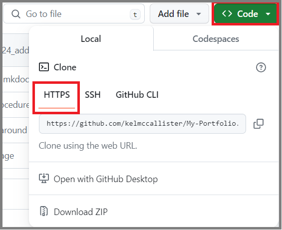
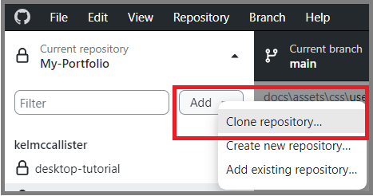

#  Quick Start Guide: GitHub Pages 

=== "Introduction"

    ## Introduction 

    GitHub Pages are public webpages hosted and published through GitHub. The following sections provide instructions on how to set up a GitHub Pages site. Complete them in order.

    ??? note "Important Note"   
        These instructions are for Windows only.

    ### Prerequisites

    Ensure that the following tools/programs have been installed:

    - [Git](https://git-scm.com/downloads)
    - [GitHub Desktop](https://desktop.github.com/)
    - [Visual Studio Code (VS Code)](https://code.visualstudio.com/)
    - [Python and Pip](https://www.python.org/downloads/)
    - [MkDocs](https://www.mkdocs.org/getting-started/)
    - [Material for MkDocs](https://squidfunk.github.io/mkdocs-material/getting-started/)
    - [Vale](https://tw-docs.com/docs/vale/install-vale/)

    ??? note "Notes"
        - Installing Python and Pip is a prerequisite to installing MkDocs.
        - Vale must be installed locally and as an extension in VS Code with spell check enabled. 

=== "Instructions"

    ## Create a Repository

    1. Open GitHub Browser.
    2. Click **New** at the top of the dashboard.

        

    3. Enter the new repository name into the corresponding field.
    4. Provide any additional settings.
    5. Click **Create repository** at the bottom of the window.

    ## Clone the Repository

    1. Navigate to the desired repository. 
    2. Click **<> Code**.
   
        

    3. Copy the URL.
    4. Open GitHub Desktop.
    5. Select the **Current repository** drop-down list.

        

    6. Click **Add** > **Clone repository**.

        

    7. Select the **URL** tab.
    8. Paste the URL into the corresponding field.
    9. Click **Clone**.

        

    ## Create a New Branch

    1. Select a repository from the **Current repository** drop-down list.
    2. Click the **Current branch** drop-down list.

        ??? note
            Ensure the current branch selected is `Main`.

    3. Click **New branch**.

        

    4. Enter the branch name into the corresponding field.
    5. Click **Create branch**.

        

    6. Click **Publish branch**.

    ## Configure the Repository

    1. Create and publish a new branch.
    2. Click **Open in Visual Studio Code** in GitHub Desktop.
    2. Open the VS Code terminal. 
    3. Run the following command to create a **docs** folder and the `mkdocs.yml` and `index.md` files:
    
        ```sh
        mkdocs new .
        ```

    4. Open the `mkdocs.yml` file.
    5. Add the following plugins to the file:

        === "MkDocs Material Plugins"
    
            ```sh
            theme:
              name: material
              icon:
                repo: fontawesome/brands/github
                edit: material/pencil
              features:
                - navigation.tabs
                - navigation.tracking
                - navigation.expand
                - toc.integrate
                - content.action.edit
              language: en
            ```

        === "Python Plugins"

            ```sh
            markdown_extensions:
            - admonition
            - codehilite
            - smarty
            - pymdownx.magiclink
            - pymdownx.betterem
            - pymdownx.details
            - pymdownx.emoji
            - pymdownx.saneheaders
            - pymdownx.highlight
            - pymdownx.critic
            - pymdownx.caret
            - pymdownx.mark
            - pymdownx.tilde
            - pymdownx.inlinehilite
            - pymdownx.tabbed:
                alternate_style: true
            - pymdownx.tasklist:
                clickable_checkbox: true
            - pymdownx.superfences:
                custom_fences:
                  - name: mermaid
                    class: mermaid
                    format: !!python/name:pymdownx.superfences.fence_code_format  
            - pymdownx.tasklist:
                custom_checkbox: true          
            - attr_list
            - md_in_html
            - sane_lists
            - tables
            ```

    6. Save the changes.
    7. Click the **New Folder** icon.

        

    8. Enter ".github/workflows".
    9. Click the **New File** icon.

        

    10. Enter "ci.yml".
    11. Open the `ci.yml` file.
    12. Paste the following into the file:

        ```
        name: ci
        on:
          push:
            branches:
              - master
              - main
        permissions:
          contents: write
        jobs:
          deploy:
            runs-on: ubuntu-latest
            steps:
              - uses: actions/checkout@v3
              - uses: actions/setup-python@v4
                with:
                   python-version: 3.x
              - uses: actions/cache@v2
                with:
                  key: ${{ github.ref }}
                  path: .cache
              - run: pip install mkdocs-material
              - run: mkdocs gh-deploy --force
        ```

    13. Save the changes.
    14. Exit the *.github* folder. 
    15. Click the **New File** icon.
    16. Enter ".vale.ini".
    17. Open the `.vale.ini` file.
    18. Paste the following into the file:
    
        ```sh
        StylesPath = .github/styles

        MinAlertLevel = warning

        Vocab = vale

        [*.md]
        BasedOnStyles = Vale
        ignore = URL, Consistency

        Vale.Terms = NO
        ```

    19. Save the changes.
    20. Select the *.github* folder
    21. Click the **New Folder** icon.
    22. Enter "styles/config/vocabularies/vale". 
    23. Click the **New File** icon.
    24. Enter "accept.txt".

        ??? note
            The `accept.txt` file allows spelling rule exceptions.

    25. Save the changes.
    26. Commit the changes to Main.

    ## Create a Virtual Environment

    ??? info
        Setting up a virtual environment within a repository's directory using Python's venv module provides the ability to preview changes made before making a commit. It will run a web server that exposes the website at [`http://127.0.0.1:8000`](http://127.0.0.1:8000).

    1. Click **Open in Visual Studio Code** in GitHub Desktop after creating a new branch.
    2. Open the terminal in VS Code.
    3. Enter the following commands into the terminal:

        ```sh
        python -m venv ./venv
        ./venv/scripts/activate
        ```

    4. Run:

        ```sh 
        mkdocs serve
        ```

    5. Open the `http://127.0.0.1:8000` link.

    ## Publish to GitHub Pages

    1. Open GitHub Browser. 
    2. Navigate to the repository being used.
    3. Select the **Settings** tab at the top of the window.

        

    4. Select **Pages** from the left-hand side menu.
    5. Select **gh-pages** from the **branch** drop-down list and select **/(root)** from the **file** drop-down list under the page's **Branch** section.

        

    6. Click **Save**.
    7. Click **Visit Site** at the top of the page.

        

| Sign-off Date | Name |
|------|------|
| 03/09/2024 | Mickey Mouse |