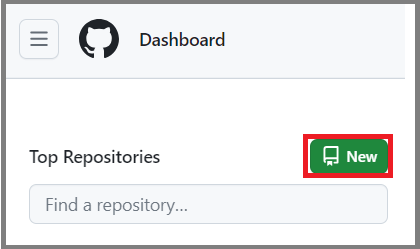
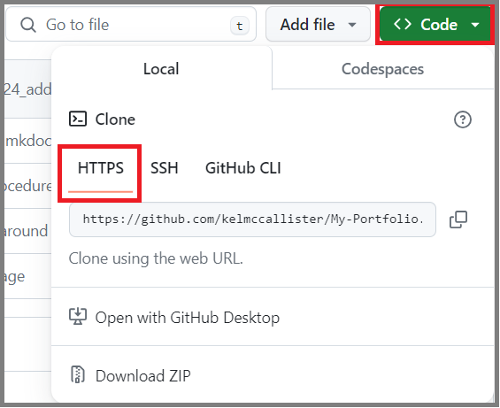
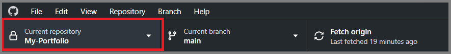
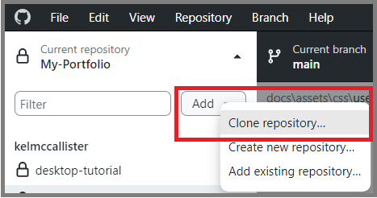
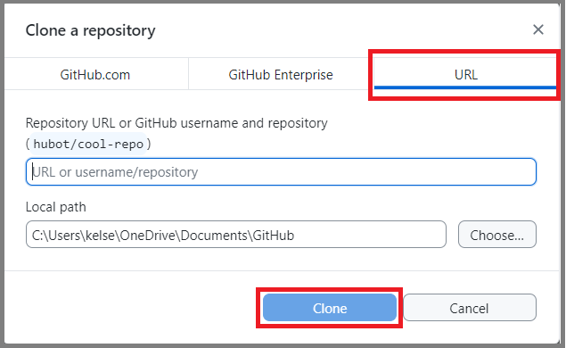
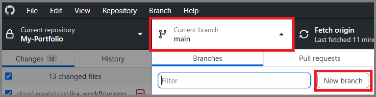
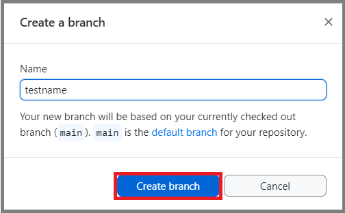
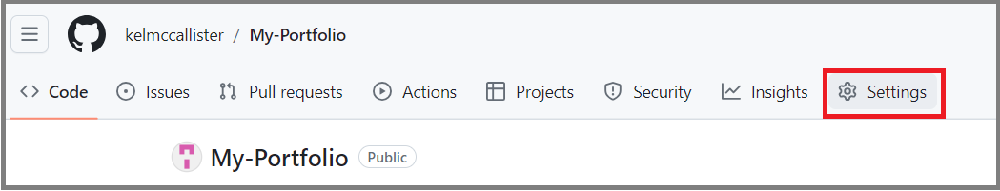
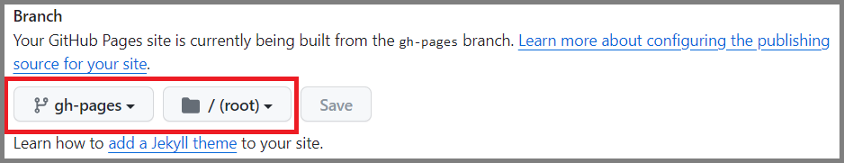
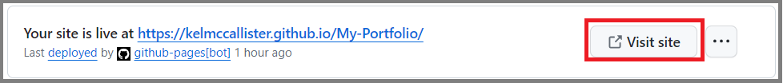

#  User Guide: Publishing to GitHub Pages 
GitHub Pages are public webpages hosted and published through GitHub. There are three types of GitHub Pages sites: project, user, and organization. Project sites are connected to a specific project hosted on GitHub, such as a JavaScript library or a recipe collection. User and organization sites are connected to a specific account on GitHub.com. This site is an example of a project site. The following sections provide instruction on how to set up a GitHub pages site. Complete them in order.

??? note "Important Note"
    These instructions are for Windows only.

## Prequisites

Ensure that the following tools/programs have been installed:

- [Git](https://git-scm.com/downloads)
- [GitHub Desktop](https://desktop.github.com/)
- [Visual Studio Code](https://code.visualstudio.com/)
- [MkDocs](https://www.mkdocs.org/getting-started/)
    - MkDocs requires [Python and Pip](https://www.python.org/downloads/) be installed. 
- [Material for MkDocs](https://squidfunk.github.io/mkdocs-material/getting-started/)
- [Vale](https://tw-docs.com/docs/vale/install-vale/)
    - Vale is used to check spelling.

## Create a Repository

1. Access GitHub browser.
2. Select the **New** button at the top of the dashboard.

    

3. Provide the new repository name within the corresponding field.
4. Provide any additional settings.
5. Select the **Create repository** button at the bottom of the screen.

## Clone the Repository

1. Select the **<> Code** button.
   
    

2. Copy the URL.
3. Open GitHub Desktop.
4. Select the "Current repository" drop-down menu.

    

5. Select "Add" > "Clone repository".

    

6. Select the URL tab.
7. Paste the URL into the corresponding field.
8. Select the **Clone** button.

    

## Create a New Branch

1. Select the cloned repository from the "Current repository" drop-down menu.
2. Select the "Current branch" drop-down menu.
3. Ensure the current branch selected is `main`.
4. Select the **New branch** button.

    

5. Provide a branch name and selet the **Create branch** button.

    

6. Select the **Publish branch** button.

## Create a Virtual Environment

??? info
    Setting up a virtual environment within a repository's directory using python's venv module provides the ability to preview changes made before making a commit by running a web server that exposes the website at [`http://127.0.0.1:8000`](http://127.0.0.1:8000).

1. Open the new branch in Visual Studio Code ("VS Code") via **Open in Visual Stuido Code** button in GitHub Desktop.
2. Enter the following commands into the VS Code terminal:

    ```sh
    python -m venv ./venv
    ./venv/scripts/activate
    ```

3. Run:

    ```sh 
    mkdocs serve
    ```

4. Select the provided `http://127.0.0.1:8000` link.

## Configure the Repository

1. Open the VS Code terminal.
2. Create the `docs` folder and the `mkdocs.yml` and `index.md` files by running:
    
    ```sh
    mkdocs new .
    ```

    ??? warning
        Only add new site pages (i.e., files) under the `docs` folder; otherwise, the files will not appear on the site.

3. Access the `mkdocs.yml` file.
4. Add the following plugins to the file:

    === "MkDocs Material Plugins"
    
        ```sh
        theme:
          name: material
          icon:
            repo: fontawesome/brands/github
            edit: material/pencil
          features:
            - navigation.tabs
            - navigation.tracking
            - navigation.expand
            - toc.integrate
            - content.action.edit
          language: en
        ```

    === "Python Plugins"

        ```sh
        markdown_extensions:
        - admonition
        - codehilite
        - smarty
        - pymdownx.magiclink
        - pymdownx.betterem
        - pymdownx.details
        - pymdownx.emoji
        - pymdownx.saneheaders
        - pymdownx.highlight
        - pymdownx.critic
        - pymdownx.caret
        - pymdownx.mark
        - pymdownx.tilde
        - pymdownx.inlinehilite
        - pymdownx.tabbed:
            alternate_style: true
        - pymdownx.tasklist:
            clickable_checkbox: true
        - pymdownx.superfences:
            custom_fences:
              - name: mermaid
                class: mermaid
                format: !!python/name:pymdownx.superfences.fence_code_format  
        - pymdownx.tasklist:
            custom_checkbox: true          
        - attr_list
        - md_in_html
        - sane_lists
        - tables
        ```

5. Save the changes.
6. Create a new folder and name it `.github`.
7. Create a sub-folder within `.github` and name it `workflows`.
8. Create a new file within the `workflows` folder and name it `ci.yml`.
9. Paste the following into the `ci.yml` file:

    ```
    name: ci
    on:
      push:
        branches:
          - master
          - main
    permissions:
      contents: write
    jobs:
      deploy:
        runs-on: ubuntu-latest
        steps:
          - uses: actions/checkout@v3
          - uses: actions/setup-python@v4
            with:
              python-version: 3.x
          - uses: actions/cache@v2
            with:
              key: ${{ github.ref }}
              path: .cache
          - run: pip install mkdocs-material
          - run: mkdocs gh-deploy --force
    ```

10. Save the changes.
11. Commit the changes to `main`.

## Publish to GitHub Pages

1. Access Github Browser. 
2. Navigate to the repository being used.
3. Select the **Settings** tab at the top of the screen.

    

4. Select **Pages** from the left-hand side menu.
5. Under the *Branch* section, select `gh-pages` from the branch drop-down menu and select `/(root)` from the file drop-down menu.

    

6. Select the **Save** button.
7. Select the **Visit Site** button at the top of the page; no further action needed.

    
